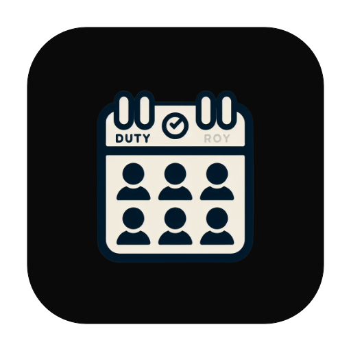
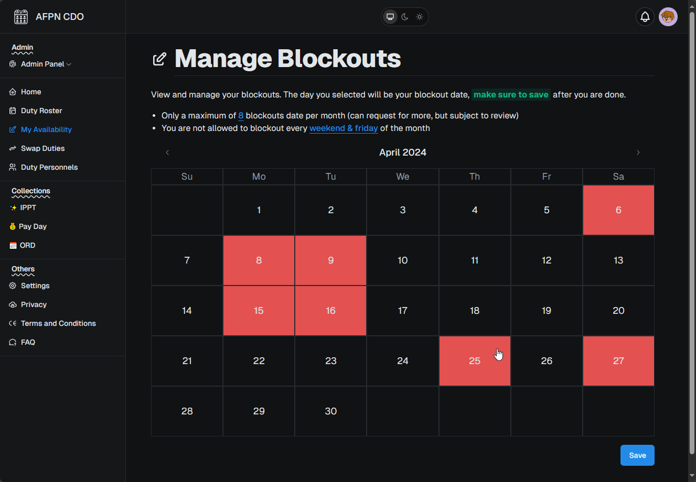

<br />
<p align="center">
  <a href="https://github.com/ISnackable/duty-roster/">
    
  </a>

  <h3 align="center">SAF Duty Roster</h3>

  <p align="center">
    A Duty Roster planner for the SAF. It's tailored for unit uses, however the code is customizable. MIT License.
    <br />
    <a href="https://afpn-cdo.vercel.app/"><strong>View Demo »</strong></a>
    <br />

  </p>
</p>

## About The Project

In SAF, soldiers are required to do duties, be it guard duty or 24hr ops duty. This project is tailored for unit, where they are required to do 24hr ops duty. The duty roster has these requirements:

1. The duty roster should be spread out in a month of a calendar
2. It is a 24-hour duty shift
3. There must be a duty personnel for each day from the start to the end of the month
4. There should not be any back-to-back duty for the same duty personnel.
5. There should be an equal number of duties for everyone if possible.
6. Personnel should be shuffled to avoid the first person always having the most number of duties
7. Personnel can have block out dates where they should not have duties on the date they have blocked out.

<br/>



## Features

- Duty roster generation with points algorithm
- Blockout dates management for personnel to avoid duties
- Duty swap request with another personnel
- Push notifications for reminders of duty and swap requests

## Getting Started

To get a local copy up and running follow these simple example steps.

### Prerequisites

You'll first need a Supabase project which can be made [via the Supabase dashboard](https://database.new).

### Clone and run locally

1. Clone this project with Git

   ```bash
   git clone https://github.com/ISnackable/saf-duty
   ```

2. Rename `.env.local.example` to `.env.local` and update the following:

   ```
   NEXT_PUBLIC_SUPABASE_URL=[INSERT SUPABASE PROJECT URL]
   NEXT_PUBLIC_SUPABASE_ANON_KEY=[INSERT SUPABASE PROJECT API ANON KEY]
   ```

   Both `NEXT_PUBLIC_SUPABASE_URL` and `NEXT_PUBLIC_SUPABASE_ANON_KEY` can be found in [your Supabase project's API settings](https://app.supabase.com/project/_/settings/api)

3. You can now run the Next.js local development server:

   ```bash
   pnpm dev
   ```

   The starter kit should now be running on [localhost:3000](http://localhost:3000/).

> Check out [the docs for Local Development](https://supabase.com/docs/guides/getting-started/local-development) to also run Supabase locally.

## Configuration

As much as this project aims to set up as seamlessly as possible, due to some limitation to Supabase, there are some config that has to be done manually.

### Create vault secrets

Navigate to [Project Vault settings](https://supabase.com/dashboard/project/_/settings/vault/secrets) in your Supabase Dashboard.

1. Create a new secret with the name `project_url`.
1. The secret value should be your project's url, you can find the it through the [Project API settings](https://supabase.com/dashboard/project/_/settings/api).
1. Repeat for the secret `service_role_key`.

### Push Notification (Optional)

To Enable Push Notification with [Web Push](https://web.dev/articles/push-notifications-web-push-protocol). You will need to deploy the Supabase Edge Function and create the database webhook manually.

#### Deploy the Supabase Edge Function

The database webhook handler to send push notifications is located in `supabase/functions/push/index.ts`. Deploy the function to your linked project and set the `WEB_PUSH_PUBLIC_KEY`, `WEB_PUSH_PRIVATE_KEY` & `WEB_PUSH_EMAIL` secret.

1. `supabase functions deploy push`
2. `supabase secrets set --env-file .env.local`

#### Create the database webhook

Navigate to the [Database Webhooks settings](https://supabase.com/dashboard/project/_/database/hooks) in your Supabase Dashboard.

1. Enable and create a new hook with the name `on_after_notifications_created`.
1. Conditions to fire webhook: Select the `notifications` table and tick the `Insert` event.
1. Webhook configuration: Supabase Edge Functions.
1. Edge Function: Select the `push` edge function and leave the method as `POST` and timeout as `1000`.
1. HTTP Headers: Click "Add new header" > "Add auth header with service key" and leave Content-type: `application/json`.
1. Click "Create webhook".

#### Sending a push notification

When a new row is added in your notifications table, a push notification will be sent to the user who has subscribed to push notification.

- _Note: There's also a cron job for [daily duty reminder](./supabase/migrations/20240130130803_enable_extensions.sql) if a user is subscribed to push notification._

  ```sql
   -- View all scheduled job.
   select * from cron.job;

   -- Or unschedule it if you want to disable it.
   select cron.unschedule('daily-roster-reminder');
  ```

## License

Distributed under the **MIT** License. See `LICENSE` for more information.

## Acknowledgements

- [supabase | Postgres Database & Authentication](https://supabase.com/)
- [shadcn/ui | React Component Library](https://ui.shadcn.com/)
